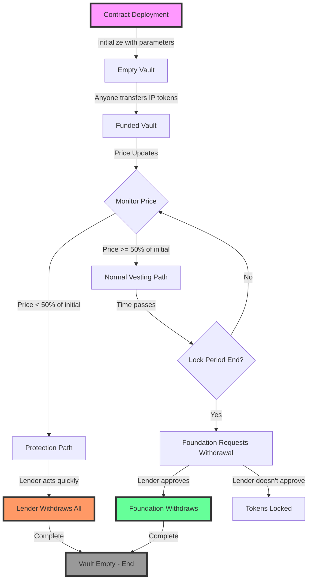
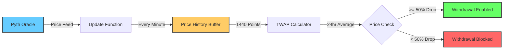
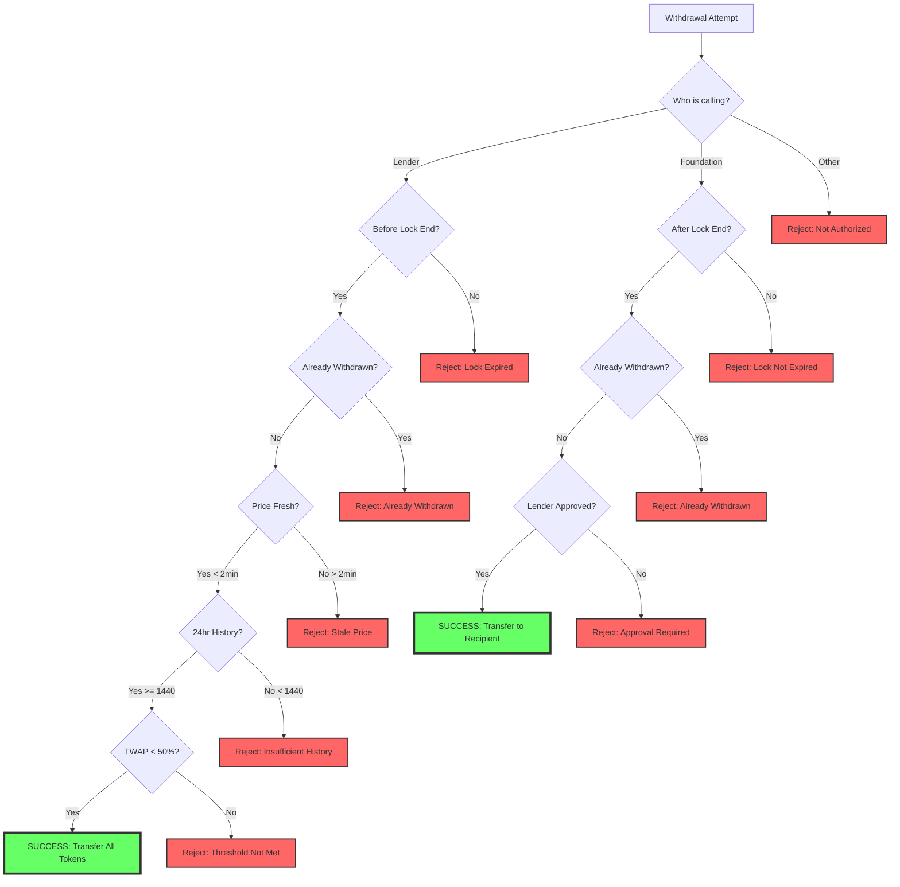
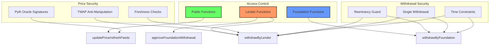

# CustodialVault Flow Diagram

## Contract Lifecycle



## Price Monitoring System



## Withdrawal Decision Tree



## Time-Weighted Average Price (TWAP) Calculation

```
Price History (Ring Buffer):
┌─────┬─────┬─────┬─────┬─────┬─────┬─────┬─────┐
│ T-24│ T-23│ ... │ T-2 │ T-1 │  T  │ T-24│ T-23│  <- Circular buffer
└─────┴─────┴─────┴─────┴─────┴─────┴─────┴─────┘
                              ↑
                        Current Index

TWAP = Σ(Price × Duration) / Total Duration

Example:
- Price at T-24h: \$1.00 for 1 hour
- Price at T-23h: \$0.95 for 1 hour
- ...
- Price at T-1h: \$0.52 for 1 hour
- Price at T: \$0.48 for 1 hour

TWAP = (1.00×1 + 0.95×1 + ... + 0.52×1 + 0.48×1) / 24
```

## Security Model



## Common Scenarios Timeline

### Scenario 1: Successful Vesting
```
Day 0                Day 120              Day 243
  |----------------------|-------------------|
  ↓                      ↓                   ↓
Deploy              Price stable         Lock ends
\$1.00               \$0.85-\$1.15         Lender approves
                                        Foundation withdraws
```

### Scenario 2: Market Crash Protection
```
Day 0      Day 30        Day 45         Day 60
  |----------|------------|--------------|
  ↓          ↓            ↓              ↓
Deploy    Price=\$0.70  Price=\$0.45   Lender withdraws
\$1.00     (30% drop)   (55% drop)    (TWAP < 50%)
```

### Scenario 3: Flash Crash (No Withdrawal)
```
Day 0      Day 30                  Day 31
  |----------|----------------------|
  ↓          ↓                      ↓
Deploy    Flash to \$0.30         Price=\$0.95
\$1.00     (few minutes)          TWAP still ~\$0.94
          No withdrawal possible
```

## Key Takeaways

1. **Dual Path System**: Either lender gets protection OR foundation gets tokens
2. **Time Windows Matter**: Act before lock period ends if price drops
3. **TWAP Protection**: Prevents manipulation but requires patience
4. **No Partial Solutions**: All-or-nothing withdrawals keep it simple
5. **Transparent Process**: All actions emit events for monitoring